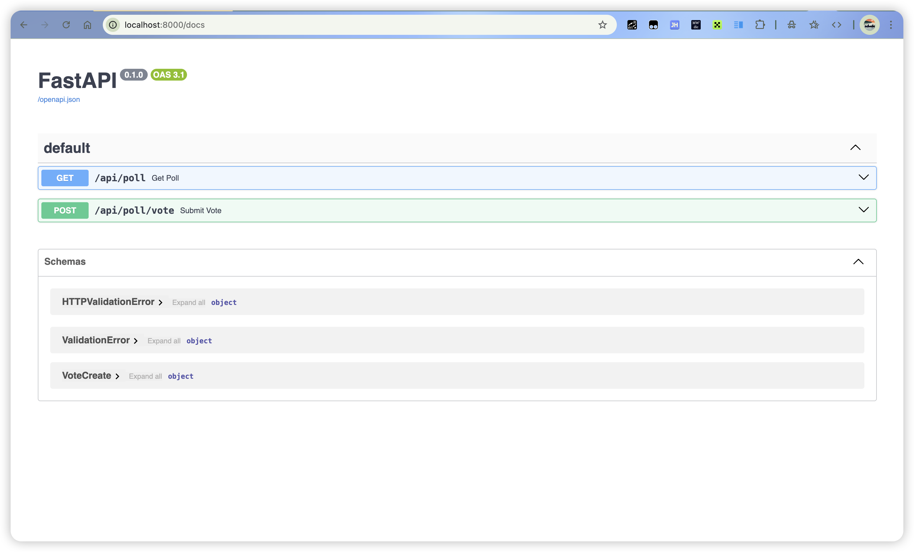
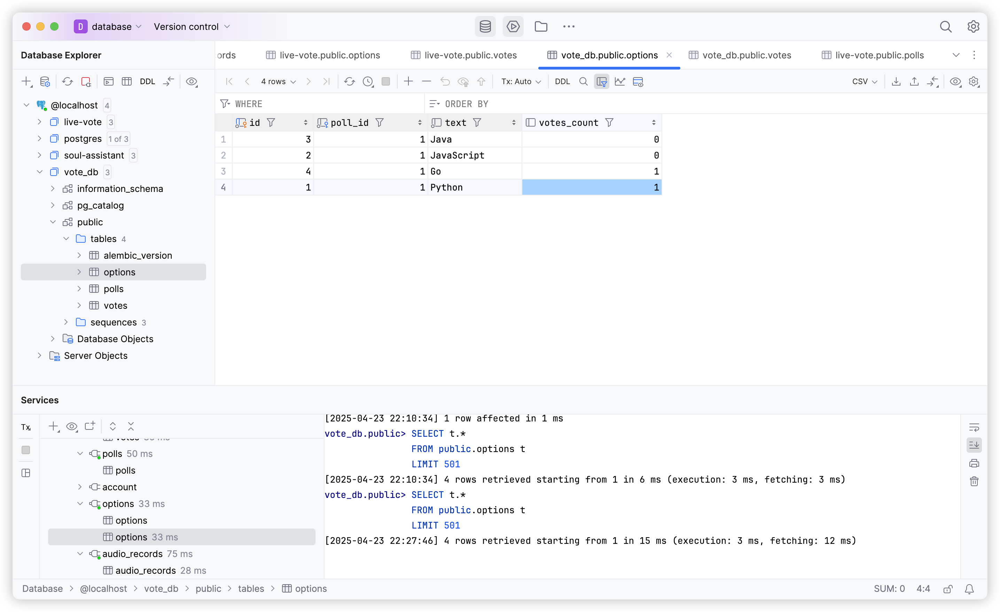

# 投票系统后端

## 环境要求
- Python 3.10+
- PostgreSQL

## 安装步骤

1. 创建虚拟环境并激活：
```bash 
conda create -n "vote" python==3.10
conda activate vote
```

2. 安装依赖：
```bash
pip install -r requirements.txt
```

3. 创建PostgreSQL数据库：
```sql
CREATE DATABASE vote_db;
```

4. 初始化数据库迁移：
```bash
alembic init alembic
alembic revision --autogenerate -m "Initial migration"
alembic upgrade head
```

5. 运行服务器：
```bash
python main.py
```

## API文档

访问 http://localhost:8000/docs 查看完整的 Swagger API 文档。

系统提供了以下主要 API 端点:

- GET /api/poll - 获取当前投票问卷和统计数据
- POST /api/poll/vote - 提交投票选项
- WebSocket /ws/poll - 订阅实时投票结果更新




## 数据库表如下

